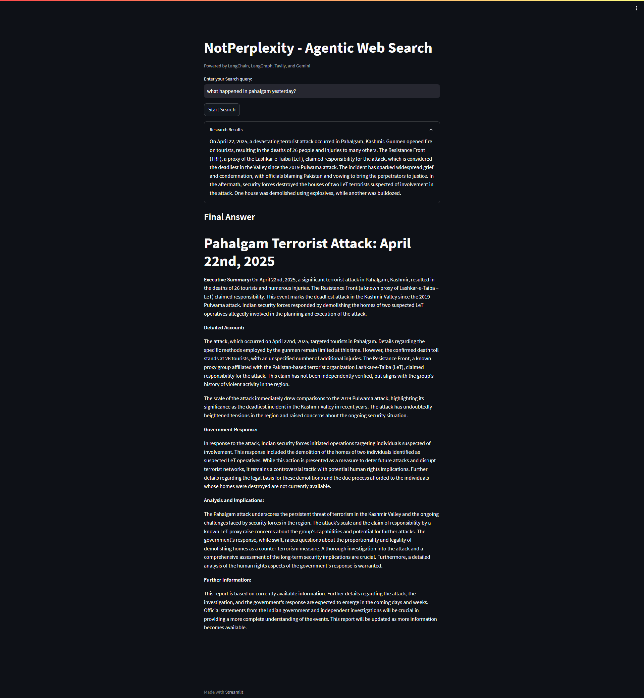

# NotPerplexity
a research agent that answers like perplexity (just for the reference) leveraging tavily search, gemini flash, langchain and langgraph

Example : 




<h1> How to Run this app ? </h1>

1. Clone the repo :
   ```
   git clone https://github.com/VamshiKrsna/NotPerplexity
   ```
2. Move into the repo and run :
   ```
   pip install -r requirements.txt
   ```
3. Create a .env file in the root and add your Google Gemini and Tavily API Keys (Langchain API is optional if you want to use Langsmith for monitoring)
  ```
  GEMINI_API_KEY = "XXXXXXXXXX"
  TAVILY_API_KEY = "XXXXXXXXXX"
  ```
4. Run the following command :
  ```
  streamlit run app.py
  ```
